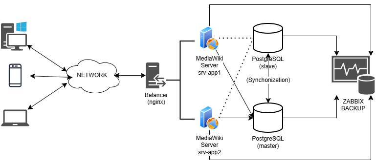

## 🧾 Этап 1. Сбор требований

Перед началом проектирования инфраструктуры необходимо собрать и зафиксировать требования к будущему сервису.  
В реальной практике системные администраторы делают это на основе запросов от заказчика или техлида.

---

### 📋 Требования к проекту

| Параметр | Описание |
|-----------|-----------|
| **ОС сервисов проекта** | Ubuntu Server 22.04 |
| **Необходимые библиотеки и фреймворки** | MediaWiki, PHP, Nginx, PostgreSQL, Zabbix |
| **Планируемая нагрузка (количество клиентов)** | Начальный этап — около 40 пользователей (центральный офис); в дальнейшем — вся компания (включая удалённых сотрудников) |
| **Специфика приложения** | Корпоративный сервис для ведения и совместного редактирования внутренней документации |
| **Интерфейс взаимодействия с пользователем** | Веб-интерфейс (HTTP) |
| **Вспомогательные сервисы** | Балансировщик нагрузки — Nginx; База данных — PostgreSQL; Система мониторинга — Zabbix; Резервное копирование — pg_dump |

---

### 💬 Диалог с техлидом

> **Майк:**  
> Нужно идти в ногу со временем и оптимизировать процесс документооборота.  
>   
> **Алексей:**  
> Чем нам поможет MediaWiki?  
>   
> **Майк:**  
> - Возможность совместного редактирования документов  
> - Бесплатное распространение  
> - Поддержка встроенных медиа (видео, изображения)  
> - Работа через веб-интерфейс без установки дополнительных программ  

---

### 📑 Вывод

По результатам обсуждения сформулированы ключевые технические требования:

- Основная ОС — **Ubuntu 22.04**  
- Сервис развертывается на **центральный офис (40 пользователей)** с возможностью масштабирования  
- Используются компоненты:
  - **Nginx** — балансировщик и веб-сервер  
  - **PostgreSQL** — база данных  
  - **pg_dump** — резервное копирование БД  
  - **Zabbix** — мониторинг инфраструктуры  
- Взаимодействие с пользователем осуществляется через **HTTP-веб-интерфейс**

---

Следующий шаг — **проектирование архитектуры инфраструктуры** для MediaWiki.

## 🧱 Этап 2. Проектирование инфраструктуры и схема развёртывания

После сбора требований необходимо спроектировать инфраструктуру сервиса и отразить её в виде схемы.  
Схема помогает понять, как между собой взаимодействуют компоненты системы и каким образом пользователи получают доступ к приложению.

---

### 🎯 Цель этапа

Создать архитектурную схему развёртывания приложения **MediaWiki**, включающую:
- серверы и их роли;
- сетевые соединения и маршруты трафика;
- размещение компонентов приложения, базы данных и веб-сервера;
- взаимодействие сервисов между собой.

---

### 🧩 Компоненты инфраструктуры

| Компонент | Назначение |
|------------|-------------|
| **Пользователи (клиенты)** | Доступ к MediaWiki через веб-браузер по HTTP/HTTPS |
| **Балансировщик (Nginx)** | Принимает входящие соединения, распределяет трафик к приложению, обеспечивает SSL |
| **Сервер приложения (MediaWiki)** | Обрабатывает HTTP-запросы, взаимодействует с базой данных |
| **База данных (PostgreSQL)** | Хранение данных MediaWiki |
| **Сервер мониторинга (Zabbix)** | Контроль состояния всех узлов, сбор метрик |
| **Резервное копирование (pg_dump)** | Автоматическое создание бэкапов БД по расписанию |

---

### 🖥️ Предлагаемое распределение ролей по серверам

| Сервер | Назначение | Программные компоненты |
|---------|-------------|-------------------------|
| **srv-web** | Балансировщик и веб-сервер | Nginx |
| **srv-app** | Сервер приложения | PHP, MediaWiki |
| **srv-db** | Сервер базы данных | PostgreSQL, pg_dump |
| **srv-monitoring** | Мониторинг и алертинг | Zabbix Server, Zabbix Agent |

*(для тестового развертывания все сервисы могут быть объединены на одной ВМ, но рекомендуется разносить их по ролям для продакшена)*

---

### 🌐 Сетевое взаимодействие

1. Пользователь обращается к сервису через веб-браузер по адресу `https://wiki.company.local`.
2. Запрос попадает на **балансировщик (Nginx)**.
3. Nginx перенаправляет трафик к **приложению MediaWiki**.
4. MediaWiki обращается к **PostgreSQL** для чтения и записи данных.
5. **Zabbix** отслеживает состояние всех серверов и уведомляет об инцидентах.

---

### 🗺️ Схема развёртывания

Схему необходимо создать с помощью сервиса [**Diagrams.net**](https://app.diagrams.net/).

**Что включить на схему:**
- Иконки серверов: web, app, db, monitoring;
- Подписи с ролями (Nginx, MediaWiki, PostgreSQL, Zabbix);
- Линии сетевых соединений с обозначением протоколов (HTTP/HTTPS, DB Connection, Zabbix Agent);
- Стрелки, отображающие направление трафика.

После создания схемы:
1. Сохраните файл в формате `.drawio` или `.png`;
2. Поместите его в папку `docs/architecture/`;
3. Добавьте ссылку в этот README.

### 🗺️ Схема архитектуры инфраструктуры

Ниже представлена архитектурная схема развертывания сервиса **MediaWiki**:

Исходный файл схемы доступен по ссылке:
[`mediawiki-deployment.drawio`](./architecture/mediawiki-deployment.drawio)

## 🧩 Этап 3. План восстановления инфраструктуры

После проектирования и развёртывания инфраструктуры необходимо продумать план восстановления на случай сбоев.  
В реальной практике такие планы составляются заранее, чтобы любой системный администратор мог оперативно устранить неисправность, даже не будучи автором проекта.

---

### 🎯 Цель этапа

Разработать понятный и воспроизводимый **план действий при отказе сервисов**:
- восстановление при выходе из строя серверов;
- переключение на реплику базы данных;
- восстановление данных из резервной копии.

---

### ⚙️ Основные задачи

| № | Сценарий отказа | Цель восстановления |
|---|------------------|--------------------|
| 1 | Отказ сервера приложения или базы данных | Запустить резервный узел и вернуть сервис в работу |
| 2 | Недоступна основная база данных | Переключить приложение на реплику |
| 3 | Повреждение или потеря данных | Восстановить базу данных из резервной копии |
